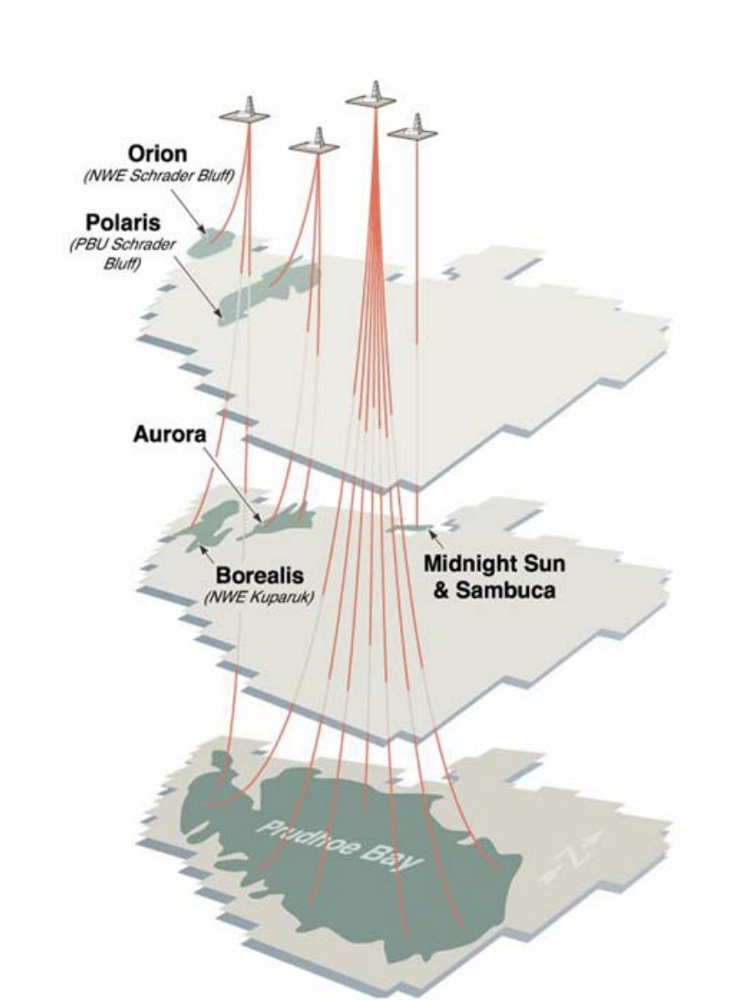
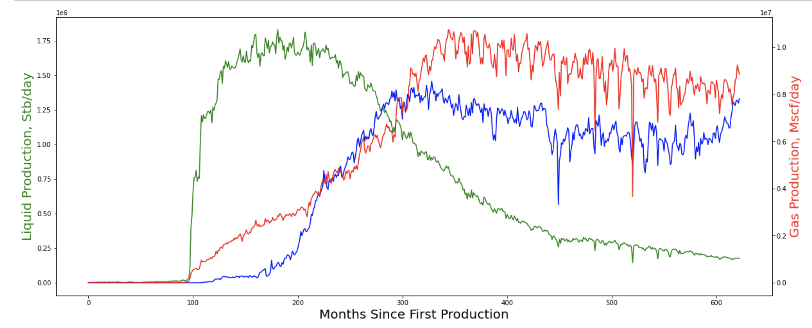

### 
 **Petroleum Engineering Alaska Application** 
#### 
The goal of my project is to provide petroleum engineers with an application/interactive dashboard for initial investigation into wells/pools of oil.

     
#### 
 Above, is a visual representation of different oil pools within alaska.  I'd like to highlight the prudhoe bay field at the bottom of the diagram.  This pool of oil has been the backbone of alaskan oil production on the north slope for 50 years.  This pool is also the pool of oil the following chart investigates.
    

 
#### 
 Above, my first chart for the interactive dashboard is shown.  On the X-axis the months of production for the Prudhoe Oil pool is shown.  The Y-axis includes oil production in green, and water production in blue. These two correspond to the left axis, liquid production volumes in stb/day. The right axis corresponds to the red line, which is gas production of the pool/well in Mscf/day. This plot is able to be shown for individual wells, pools, or fields. This well accurately represents real data of the prudhoe bay field, which can be verified via google.  The peak production of this reservoir unit was about 1.6 million barrels per day and has since been flooded with gas and water production (most of which is being injected, which will be shown by further analysis)
 
#### 
 There are several more charts that I intend to include in my streamlit including injection data, cumulatives, ratios such as water cut, a decline curve, and a map of wells, most of which is already in the works.