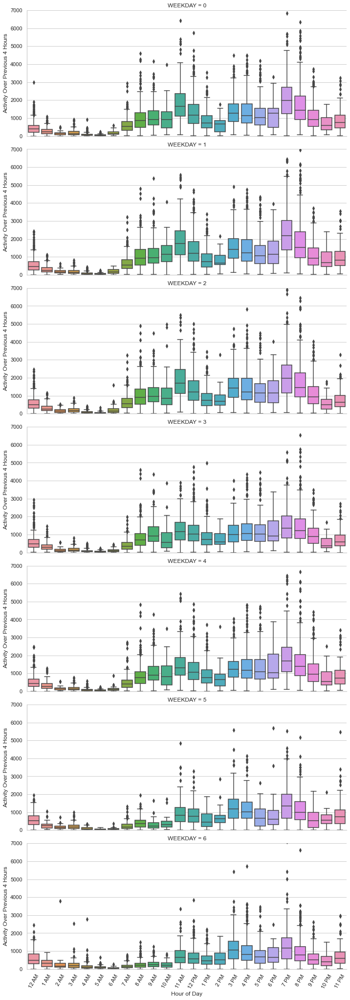

### 
 **Analysis of New York Subway Traffic (12/20/20 to 3/19/21)** 
#### 
The goal of my project is to identify key times of day for employees to travel to work during covid to minimize exposure and risk.

    
     
##### 
 I used a column of box-plots to display the time-series data of all New York station activity by the day of the week. Each box represents the data for the 4 hours leading up to the box. Each row represents the day of the week, starting with Monday and ending with Sunday. 

##### 
 In the chart, on weekdays, there seems to be a decreasing trend in activity between 12 pm and ending at 2 pm. This corresponds to a real decrease in activity between 8 am and 10 am after an initial spike of traffic near 7 am. So far, the general recommendation seems to be: go into work between 9 and 10 am and leave work between 7pm and 9 pm.  There will be further investigations including: specific stations/locations, outliers in the data, and potentially shifting the chart by 4 hours.
