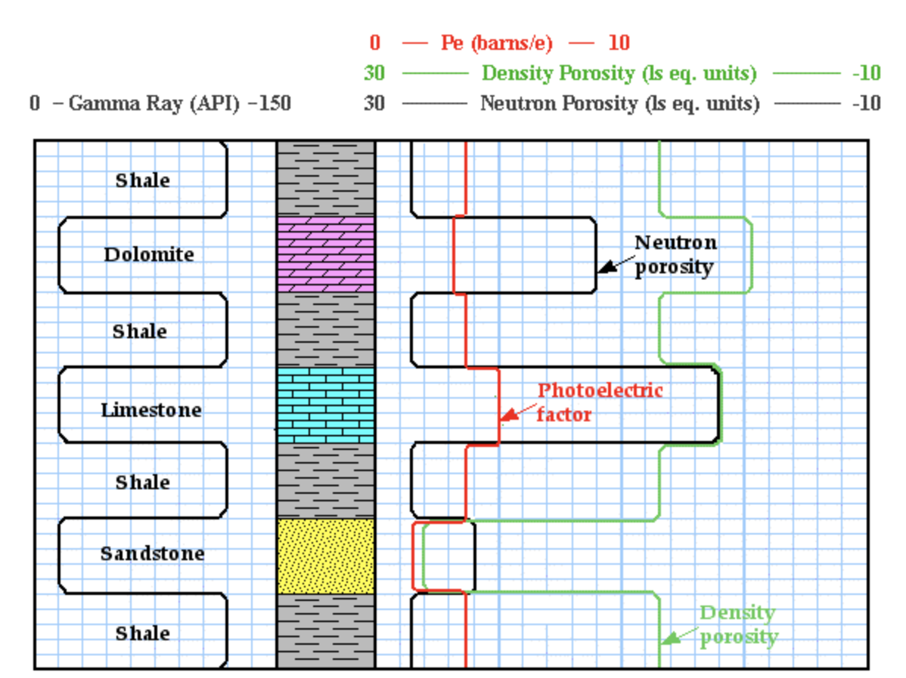

 
    
# **MLC Project Proposal**
##### **- Matthew Dupree**
## Question/Need:
### **1. What is the framing question of your analysis, or the purpose of the model/system you plan to build?**

#### Geologic data collection for reservoir analysis include: Seismic (large areal extent, low resolution data), well logs (4-5 ft areal extent from a well and higher resolution data), and cores (6" ~ 1'  areal extent, very high resolution data) that are processed in a lab. 

#### Because of the cost of data collection, the quantity of the data decreases as the data collection technique moves from higher areal coverage to lower areal coverage.  For this project, I would like to use well logs to create a classification model for near-wellbore rock type.  The classification will consist of 3 classes: Limestone, shale, and sandstone.

### **2. Who benefits from exploring this question or building this model/system?**

#### Lithological classification is always done in drilled wells to understand the geologic properties of the near-wellbore region.  This model will serve to perform this analysis in a simplified manner for free. Geologists, reservoir engineers, and small oil companies can benefit from this analysis

## Data Description:
### **3. What dataset(s) do you plan to use, and how will you obtain the data?**
#### In order to perform this analysis, I will use the Equinor Volve dataset which has been released publicly for the furthering of education. Equinor is a Norwegian state-owned energy company and Volve Field is an oilfield in the North Sea that produced between 2008 and 2016.  All field-related data was  generously released for public use.
    
####The data that will be used in this investigation are the petrophysical properties of the near-wellbore rocks. There are 20+ wells where this data is provided.  I will also be using physical measurements of the drilling process such as rate of penetration through the rock.

### **4. What is an individual sample/unit of analysis in this project? What characteristics/features do you expect to work with?**
#### The data that is provided for this analysis includes: Gamma ray logs, Mud logs, bulk density logs, neutron porosity logs, density porosities. The lithological properties of the rocks can be determined accurately with a combination of these features.
    

### **5. If modeling, what will you predict as your target?**
#### The target for prediction will be lithologies of the near-wellbore rocks. These predictions will be verified using the cuttings that were recovered while drilling (the rock pieces recovered from the rock that was drilled)

    
## Tools:
### **6. How do you intend to meet the tools requirement of the project?**
#### I will use microsoft Azure (or github) to access the public data.  After the data is cleaned, I will use several classification models with the different log parameters as inputs to predict lithology.

### **7. Are you planning in advance to need or use additional tools beyond those required?**
#### I am not planning to use additional tools at this point.

## MVP Goal:

### **8. What would a minimum viable product (MVP) look like for this project?**
#### Although I expect these features to be quite predictive, the minimum viable product for this project is a baseline classification model that displays some level of predictive capability of lithology.